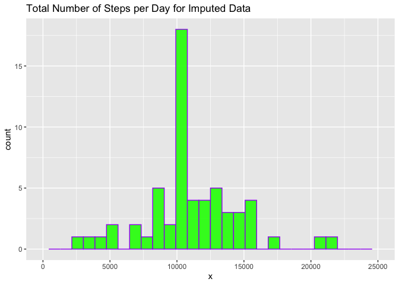

## Loading and preprocessing the data

```r
# load the required libraries
library(ggplot2)

#unzip the file and load the data

unzip("./activity.zip")
data1 <-read.csv("./activity.csv")
head(data1)
```

```
##   steps       date interval
## 1    NA 2012-10-01        0
## 2    NA 2012-10-01        5
## 3    NA 2012-10-01       10
## 4    NA 2012-10-01       15
## 5    NA 2012-10-01       20
## 6    NA 2012-10-01       25
```

```r
summary(data1)
```

```
##      steps            date              interval     
##  Min.   :  0.00   Length:17568       Min.   :   0.0  
##  1st Qu.:  0.00   Class :character   1st Qu.: 588.8  
##  Median :  0.00   Mode  :character   Median :1177.5  
##  Mean   : 37.38                      Mean   :1177.5  
##  3rd Qu.: 12.00                      3rd Qu.:1766.2  
##  Max.   :806.00                      Max.   :2355.0  
##  NA's   :2304
```


## What is total number of steps taken per day?


```r
total_stepsperday <-aggregate(steps ~ date, data1, sum, na.rm=TRUE)
```

##Histogram of the total number of steps taken per day 


```r
hist(total_stepsperday$steps, main = "Total Steps per Day", xlab = " Number of Steps", ylab = "Frequency", col = "purple", ylim = c(0, 20), breaks = seq(0, 25000, by =2500))
```

<!-- -->
## Mean and Median of Total number of steps taken per day


```r
mean(total_stepsperday$steps)
```

```
## [1] 10766.19
```

```r
median(total_stepsperday$steps)
```

```
## [1] 10765
```
The mean total number of steps taken per day is 10766 and median total number of steps is 10765. There is not much of a difference between the mean and the median number of steps taken per day. 

## What is the average daily activity pattern?


```r
total_stepsperInterval <-aggregate(steps ~ interval, data1, mean, na.rm=TRUE)
plot(steps~interval, data =total_stepsperInterval, type = "l", col = "blue", main = "Average Daily Activity Pattern", xlab = " Interval", ylab = "Average Number of Steps" )
```

<!-- -->
## Which 5-minute interval, on average across all the days in the dataset, contains the maximum number of steps


```r
total_stepsperInterval[which.max(total_stepsperInterval$steps),]
```

```
##     interval    steps
## 104      835 206.1698
```
Interval 835 contains the maximum average steps of 206.16

## Imputing missing values

### Calculating the total number of missing values


```r
nrow(data1)
```

```
## [1] 17568
```


```r
no_missing <-sum(is.na(data1$steps))
no_missing
```

```
## [1] 2304
```

```r
percent_missing <- sum(is.na(data1$steps))/nrow(data1)
percent_missing
```

```
## [1] 0.1311475
```
13.11% of the data about the number of steps (2304 out of 17568 rows) are missing. 

### Strategy for imputing missing values
We will use the mean of the five minute interval to impute missing values


```r
imputed_steps <- total_stepsperInterval$steps[match(data1$interval, total_stepsperInterval$interval)]
```

### Create a new dataset with imputed values


```r
data1_imp <- transform(data1, steps = ifelse(is.na(data1$steps), yes = imputed_steps, no = data1$steps))
```

### Histogram of total number of steps taken each day for imputed dataset


```r
total_steps_imp <- aggregate(steps ~ date, data1_imp, sum)
names(total_steps_imp) <- c("date", "steps")
hist(total_steps_imp$steps, main = "Total Steps per Day for Imputed Data", xlab = " Number of Steps", ylab = "Frequency", col = "purple", ylim = c(0, 30), breaks = seq(0, 25000, by =2500))
```

<!-- -->

### Mean and Median of Total Number of Steps Taken each day for imputed data

```r
mean(total_steps_imp$steps)
```

```
## [1] 10766.19
```

```r
median(total_steps_imp$steps)
```

```
## [1] 10766.19
```

The mean and median for the imputed data set is the same. 

## Are there differences in activity patterns between weekdays and weekends?


```r
data1$date <-as.Date(strptime(data1$date, format = "%Y-%m-%d"))
data1$dayofweek <-weekdays(data1$date)
for (i in 1:nrow(data1)) {
    if (data1[i,]$dayofweek %in% c("Saturday","Sunday")) {
        data1[i,]$dayofweek<-"Weekend"
    }
    else{
        data1[i,]$dayofweek<-"Weekday"
    }
}
```


Panel plot 


```r
data1_agg <- aggregate(steps ~ interval +dayofweek, data1, mean, na.rm=TRUE)
plot <- ggplot(data1_agg, aes(x= interval, y = steps, color = dayofweek)) +           geom_line() + 
        labs(title = "Average Daily Steps by Day of Week", x = "Interval", y= "Average Number of Steps") + 
  facet_wrap(~dayofweek, ncol=1, nrow=2)
print(plot)
```

<!-- -->

